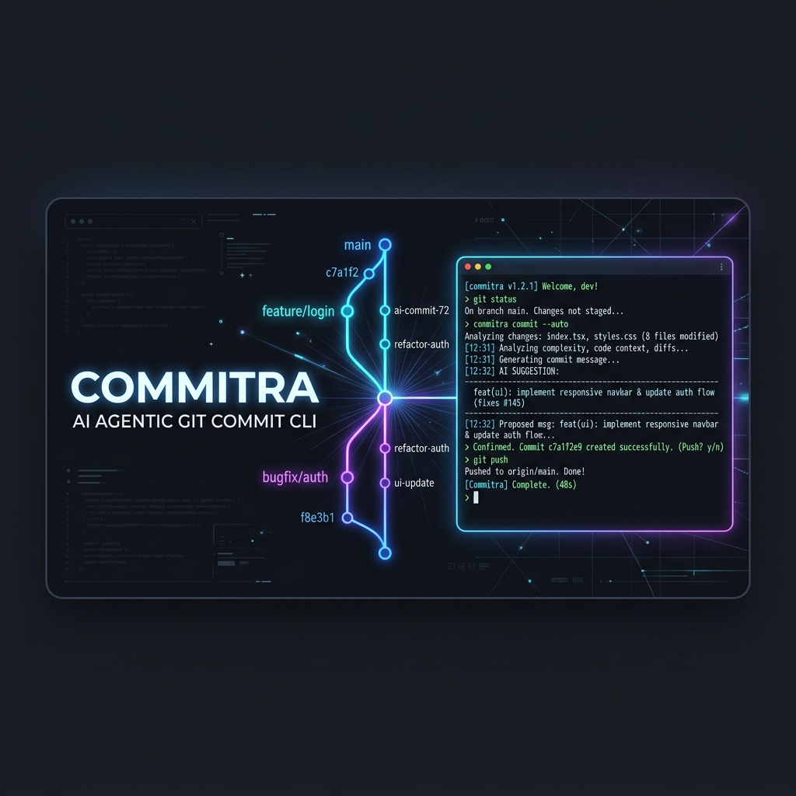
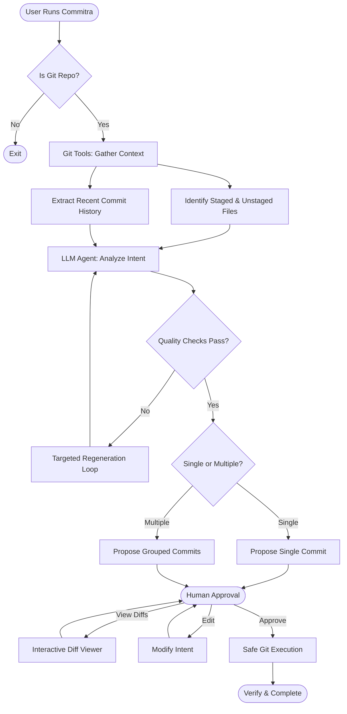
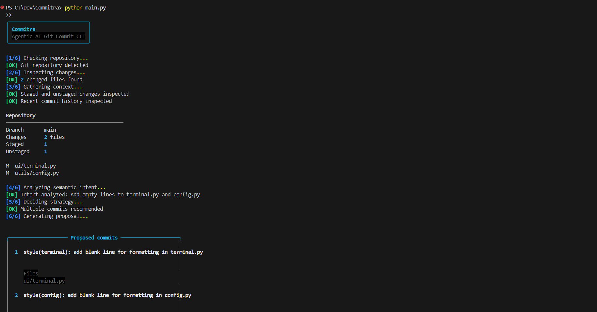
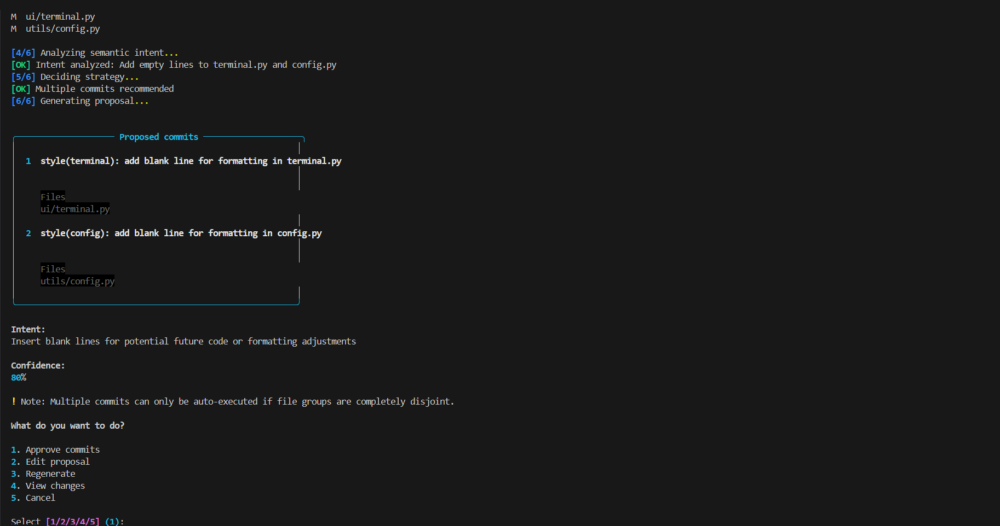

<div align="center">
  

  # Commitra
  **Agentic AI Git Commit CLI**
  
  <p>
    
    
    
  </p>
  <p>
    <em>Intelligently analyze repository changes and create meaningful, context-aware Git commits through an agentic workflow.</em>
  </p>
</div>

---

## 🚀 The Problem

Creating high-quality, descriptive Git commits is often treated as an afterthought. Standard AI wrappers usually just pipe `git diff` to an LLM, which:
- Ignores broad repository context
- Fails on massive diffs
- Blindly exposes sensitive secrets
- Creates noisy, generic descriptions
- Groups unrelated files incorrectly

**Commitra solves this** by operating not as a text-generator, but as an **Agent**.

---

## 🧠 Why Agentic AI?

Commitra acts autonomously but safely. It follows a rigorous workflow before touching your repository:

`Observe → Gather Context → Analyze → Decide → Propose → Human Approval → Act → Verify`

It inspects the state of the repository, uses deterministic tools to pull safe data, makes independent strategic decisions (like grouping commits vs single commits), waits for explicit human approval, and then safely executes actions.

---

## ✨ Features

- **Semantic Grouping**: Commitra groups your changes into multiple logical commits based on concern, not just file boundaries.
- **Interactive Diff Viewer**: A built-in, file-first `+X -Y` interactive diff viewer so you can inspect exactly what the AI is proposing.
- **Privacy First**: Automatically redacts sensitive files (e.g., `.env`, `.pem`, `id_rsa`) from the LLM prompt.
- **Strict Quality Control**: Deterministic quality loops automatically intercept and regenerate vague or generic LLM filler (e.g., "update code", "improve UX").
- **Smart Chunking**: Truncates oversized diffs to maintain stability and save tokens.
- **Beautiful UI**: An ultra-modern terminal interface powered by Rich.

---

## 🏗️ Architecture Flow



---

## 💻 Terminal Experience

Commitra delivers a stunning, distraction-free interface right in your terminal. 

<div align="center">
  
  

</div>

---

## ⚙️ Installation

1. **Clone the repository:**
   ```bash
   git clone https://github.com/UBX-CODE/Commitra.git
   cd Commitra
   ```

2. **Set up a virtual environment:**
   ```bash
   python -m venv venv
   
   # Windows:
   venv\Scripts\activate
   # macOS/Linux:
   source venv/bin/activate
   ```

3. **Install dependencies:**
   ```bash
   pip install -r requirements.txt
   ```

---

## 🔑 Configuration

Copy the example environment file to `.env`:
```bash
cp .env.example .env
```

Open `.env` and add your **Groq API Key**:
```env
GROQ_API_KEY=gsk_your_api_key_here
GROQ_MODEL=llama-3.3-70b-versatile
MAX_DIFF_CHARS=30000
RECENT_COMMIT_COUNT=5
```

---

## 🛠️ Usage

To launch the Agent, simply navigate to your modified Git repository and run:

```bash
python main.py
```

Commitra will automatically analyze the diff, apply semantic grouping, and generate a proposal for your review!

---

## 🛡️ Safety Guarantees

Commitra is designed to never perform destructive actions blindly.

1. **No `shell=True`**: All Git commands use explicit argument lists via Python's `subprocess`.
2. **Explicit Staging**: Commitra explicitly stages paths (e.g. `git add -- file1 file2`) instead of running `git add .`.
3. **No LLM Execution**: The LLM output is strictly validated JSON and cannot execute commands.
4. **Approval Required**: No commit is ever executed without explicit human consent via the terminal prompt.

---

<div align="center">
  <i>Built for developers who value their commit history.</i>
</div>
